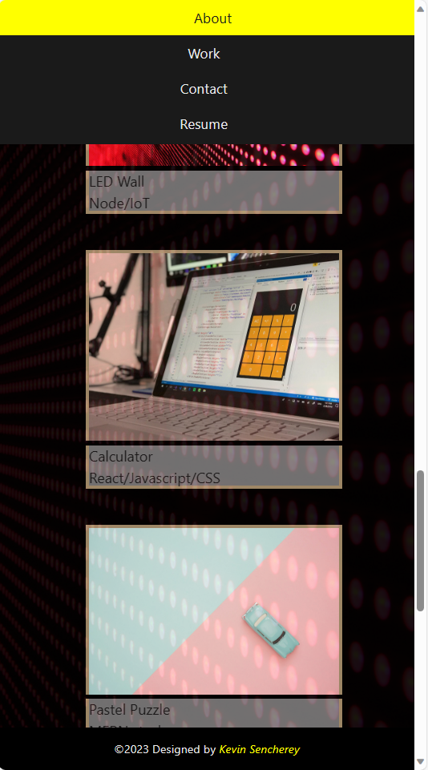
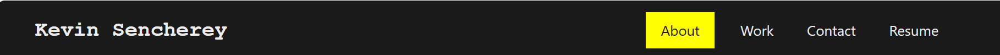
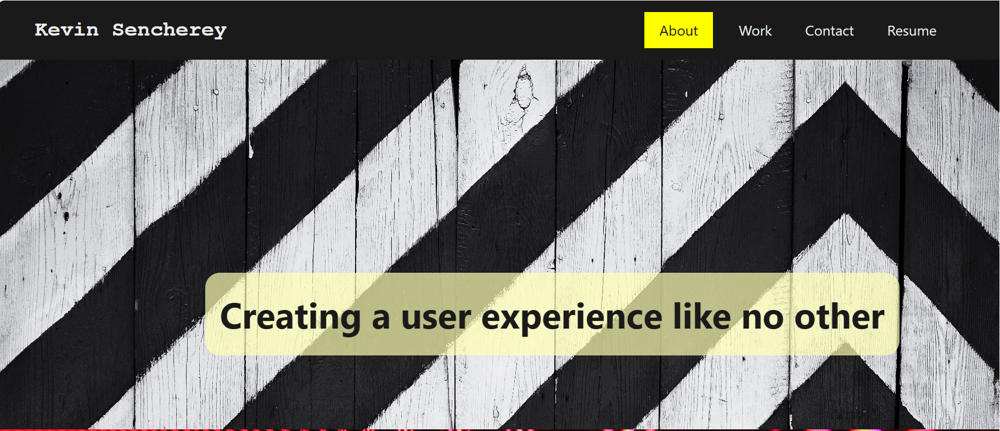
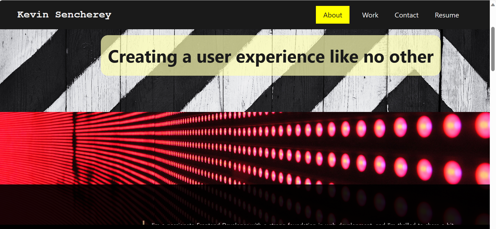
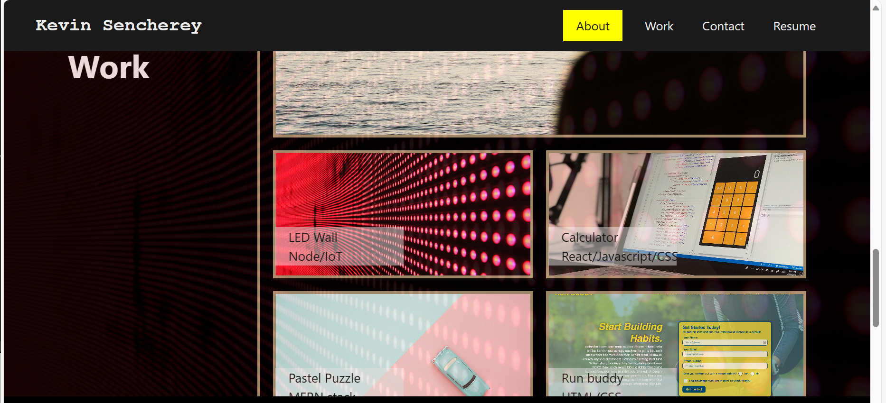
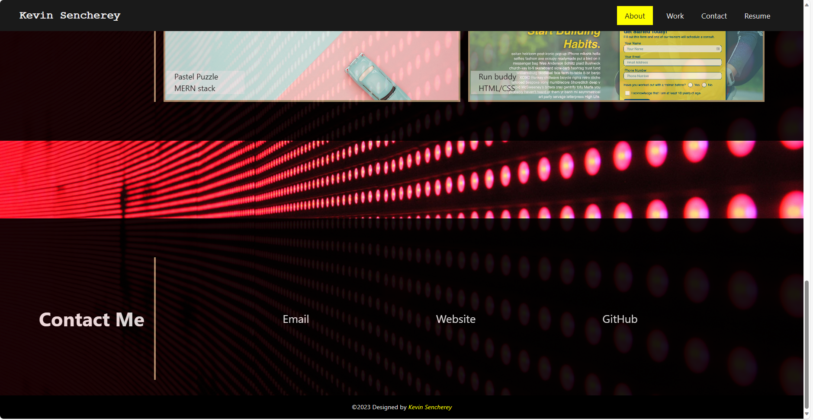

# bootcamp-portfolio

A portfolio of work done during edX Front end software development bootcamp

## Description

Here is a short description of the project

## What the project does

This website is a portfolio which showcase work carried out in the oigoing Frontend Development bootcamp with edX. Users who visit the website, can download my resume, contact me via `email` and access my GitHub account to see a llist of work done.
They can also see a pictorial view of projects developed during the bootcamp.

### Project response to mobile layout

Media query was added to the code to make the website respond to mobile layout

### Here are a few snapshots of the website

### Technologies Used

HTML - `Hyper Text Markup Language` was used to display the structure of the content of the landing page project in a browser

CSS - `Cascading Style Sheets` was used to style of the HTML content of the page.

### How to access the landing page

To access the landing page project, click on the link below

[Bootcamp portfolio project](https://ksencherey.github.io/bootcamp-portfolio/)

### Further work

As the bootcamp is ongoing, the portfolio will be updated with lists of finished projects and media queries will be added to make the website page respond to diverse screen resolutions.
